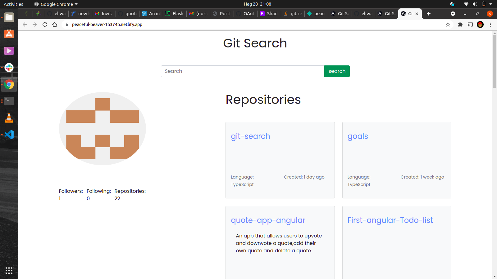

# GitSearch

# Author

[amon-wanyonyi]()

# Description
 This is an angular application, which a client can search for username and repositories that theyve pushed to github.

 [livesite-link](https://peaceful-beaver-1b374b.netlify.app/)

 # Screenshot
 

 # installation/setup installation

 * open terminal
 * git clone repository https://github.com/amon-wanyonyi/git-search.git
 * cd Git-Search
 * code . to open in text editor

 # Technology Used

* HTML
* CSS
* Bootstrap 
* AngularCli

# Known Bugs

* Reseting the form and displaying error messages

# Contact Information
 * For inquiries and concerns about the project contact via [email](xxx110680@gmail.com)

 # Lisence

 * MIT Linsence
 * Copyright (c) 2021.
 **Amon Wanyonyi**